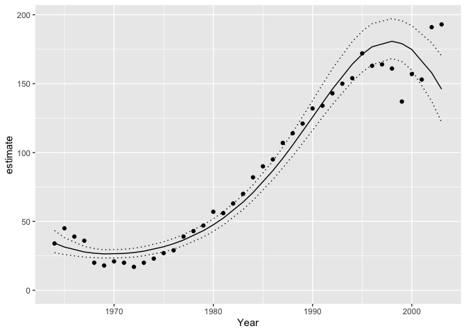

<!-- README.md is generated from README.Rmd. Please edit that file -->

[](https://www.tidyverse.org/lifecycle/#maturing)
[](https://travis-ci.org/poissonconsulting/smbr)
[](https://ci.appveyor.com/project/poissonconsulting/smbr)
[](https://codecov.io/gh/poissonconsulting/smbr)
[](https://opensource.org/licenses/MIT)
[](https://doi.org/10.5281/zenodo.1162382)

# smbr

## Introduction

`smbr` (pronounced simber) is an R package to facilitate analyses using
[`STAN`](http://mc-stan.org). It is part of the
[mbr](https://github.com/poissonconsulting/mbr) family of packages.

## Demonstration

``` r
library(bauw)
library(ggplot2)
library(magrittr)
library(smbr)
```

``` r
# define model in Stan language
model <- model("
  data {
      int nAnnual;
      int nObs;
      int Annual[nObs];
      int Pairs[nObs];
      real Year[nObs];
  }
  parameters {
      vector[nAnnual] bAnnual;
      real log_sAnnual;
      real alpha;
      real beta1;
      real beta2;
      real beta3;
  }
  transformed parameters {
    real sAnnual;
    sAnnual = exp(log_sAnnual);
  }
  model {
      vector[nObs] ePairs;
    
      log_sAnnual ~ normal(0, 10);
      bAnnual ~ normal(0, sAnnual);

      alpha ~ normal(0, 10);
      beta1 ~ normal(0, 10);
      beta2 ~ normal(0, 10);
      beta3 ~ normal(0, 10);

      for (i in 1:nObs) {
        ePairs[i] = exp(alpha + beta1 * Year[i] + beta2 * Year[i]^2 + 
                      beta3 * Year[i]^3 + bAnnual[Annual[i]]);
      }
      target += poisson_lpmf(Pairs | ePairs);
  }")

# add R code to calculate derived parameters
model %<>% update_model(new_expr = "
  for (i in 1:length(Pairs)) {
    prediction[i] <- exp(alpha + beta1 * Year[i] + beta2 * Year[i]^2 + 
                       beta3 * Year[i]^3 + bAnnual[Annual[i]])
  }
")

# define data types and center year
model %<>% update_model(
  select_data = list("Pairs" = integer(), "Year*" = integer(), 
                     Annual = factor()),
  derived = "sAnnual",
  random_effects = list(bAnnual = "Annual"))

data <- bauw::peregrine
data$Annual <- factor(data$Year)

set.seed(42)

# analyse
analysis <- analyse(model, data = data, seed = 3L, glance = FALSE)

# coefficient table
coef(analysis)
#> # A tibble: 5 x 7
#>   term        estimate     sd   zscore   lower   upper   pvalue
#> * <S3: term>     <dbl>  <dbl>    <dbl>   <dbl>   <dbl>    <dbl>
#> 1 alpha         4.26   0.0408  104      4.18    4.34   0.000300
#> 2 beta1         1.19   0.0744   16.0    1.06    1.35   0.000300
#> 3 beta2        -0.0182 0.0305 -  0.579 -0.0762  0.0420 0.543   
#> 4 beta3        -0.272  0.0378 -  7.23  -0.350  -0.204  0.000300
#> 5 log_sAnnual  -2.22   0.322  -  7.02  -3.07   -1.73   0.000300

# trace plots
plot(analysis)
```

<!-- --><!-- -->

``` r
# make predictions by varying year with other predictors including the random effect of Annual held constant
year <- predict(analysis, new_data = "Year")

# plot those predictions
ggplot(data = year, aes(x = Year, y = estimate)) +
  geom_point(data = bauw::peregrine, aes(y = Pairs)) +
  geom_line() +
  geom_line(aes(y = lower), linetype = "dotted") +
  geom_line(aes(y = upper), linetype = "dotted") +
  expand_limits(y = 0)
```

<!-- -->

## Installation

``` r
# install.packages("devtools")
devtools::install_github("poissonconsulting/smbr")
```

## Citation

``` 

To cite smbr in publications use:

  Chris Muir and Joe Thorley (2018) smbr: Analyses Using STAN.
  doi: https://doi.org/10.5281/zenodo.1162382.

A BibTeX entry for LaTeX users is

  @Misc{,
    author = {Chris Muir and Joe Thorley},
    year = {2018},
    title = {smbr: Analyses Using STAN},
    doi = {https://doi.org/10.5281/zenodo.1162382},
  }

Please also cite STAN.
```

## Contribution

Please report any
[issues](https://github.com/poissonconsulting/smbr/issues).

[Pull requests](https://github.com/poissonconsulting/smbr/pulls) are
always welcome.

Please note that this project is released with a [Contributor Code of
Conduct](CONDUCT.md). By participating in this project you agree to
abide by its terms.
